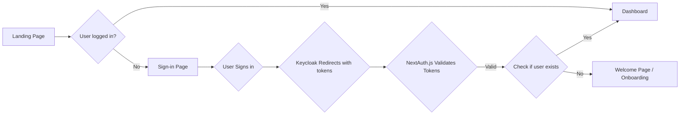

## Authentication Overview

**Audience:** Developers Maintaining the Project
**Purpose:** Explain the componenets involved in the authentication process, (next auth, keycloak, etc.) and how they interact with each other so developers can understand the flow of authentication in the system and where to look for debugging issues.

NutriNova employs a robust authentication process to ensure secure access and user data protection. The system leverages **NextAuth.js** as the primary authentication library and integrates with **Keycloak** as the identity provider (IDP).

### Components

1. **NextAuth.js**: This library manages the authentication flow within the NutriNova application. It handles aspects such as user login, session management, and integration with external IDPs.
2. **Keycloak**: An open-source identity and access management solution, Keycloak serves as the central repository for user identities and access control policies.
3. **OpenID Connect (OIDC)**: NutriNova utilizes OIDC, an identity layer built on top of the OAuth 2.0 protocol, to facilitate secure communication and exchange of authentication information between NextAuth.js and Keycloak.

Instructions for setting up Keycloak are in the [Keycloak Repo](https://github.com/Cwighty/keycloak/blob/main/SETUP.md)

### Authentication Flow

1. **User Login Initiation**: When a user attempts to access a protected route or feature within the NutriNova application, NextAuth.js redirects them to the Keycloak login page.
2. **Authentication with Keycloak**: The user provides their credentials on the Keycloak login page. Keycloak verifies the credentials and, upon successful authentication, issues an ID token and an access token to NextAuth.js.
3. **Token Validation**: NextAuth.js validates the received tokens to ensure their authenticity and integrity. This includes verifying the signature, expiration time, and issuer of the tokens.
4. **Session Creation**: Upon successful token validation, NextAuth.js creates a session for the user. The session data, including user information and relevant claims from the ID token, is stored securely, often using cookies or server-side storage mechanisms.
5. **Access Control**: NextAuth.js uses the claims present in the access token to enforce access control policies. This ensures that users only have access to authorized resources and features based on their roles and permissions.

### Refreshing the Authentication Token

To maintain uninterrupted access for users, NutriNova implements automatic token refresh using the `jwt` callback function within `api/auth/[...nextauth]/options.ts`. This callback is invoked before each request and checks the expiration time of the access token. If the token is nearing expiration, NextAuth.js attempts to refresh it using the refresh token obtained during the initial login process. The refreshed token is then used for subsequent requests, ensuring a seamless user experience.

### Routing and Access Control

NutriNova's file structure employs the `(authorized)` and `(public)` folders in the Next.js app directory to differentiate between protected and public routes. The `middleware.ts` file located at the app's root level intercepts incoming requests and determines whether the user has a valid authentication token.

- **Protected Routes**: If the request targets a route within the `(authorized)` folder and the user has a valid token, they are granted access. Otherwise, they are redirected to the login page.
- **Public Routes**: Requests for routes within the `(public)` folder, such as the landing page or static assets, are always allowed, regardless of the user's authentication status.

To ensure that images are accessible in public sections of the application, you can add their paths to the `publicRoutes` array within `middleware.ts`. This array specifies routes that should be allowed for all users, bypassing the authentication check. By including image paths in this array, you guarantee that they are served correctly even when the user is not logged in.

### Login Flow

