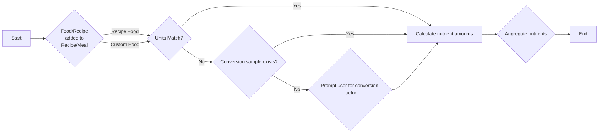

## Nutrient Summation and Unit Conversion

**Audience:** Maintainers of Project
**Purpose:** Provide an overview of the nutrient summation and unit conversion process in NutriNova

NutriNova's nutrient totaling feature involves a multi-step process of summing nutrients from individual food items and converting units as necessary, both when adding foods to recipes and when incorporating foods/recipes into meals. The primary classes involved in this process include `RecipeFoodTotaler`, `UnitConverter`, and `FoodConversionSampleExtensions`. Relevant information is retrieved from the `FoodPlan`, `RecipePlan`, and `Unit` entities.

### Adding Foods to Recipes

1. **Identify Units**: The system determines the serving size unit of the food item from the `FoodPlan` entity and the unit in which the user is adding it to the recipe from the `RecipeFood` entity.
2. **Check for Conversion Sample**: The system checks if a conversion sample exists for the specific food and unit combination within the `FoodConversionSample` entity using the `GetMatchingFoodConversionSample` method from the `FoodConversionSampleExtensions` class. A conversion sample provides a pre-defined conversion factor between the food's serving size unit and the unit used in the recipe.
3. **Apply Conversion or Request Conversion Factor**:
   - If a conversion sample exists, the system applies the conversion factor to calculate the equivalent amount in the food's serving size unit. This allows for accurate nutrient calculations based on the food's nutritional information per serving.
   - If no conversion sample exists and the units belong to different categories (e.g., grams vs. cups), the system prompts the user to provide the conversion factor (how many food servings are in one unit of the measurement being added). This information is then stored as a new conversion sample for future use.
4.
5. **Calculate Nutrient Amounts**: Once the quantity is expressed in the food's serving size unit, the system calculates the total amount of each nutrient by multiplying the nutrient content per serving (obtained from `FoodPlanNutrient` entity) by the converted quantity. The `GetNutrientAmountPerFoodServingUnit` method within the `FoodPlanNutrientExtension` class assists in this calculation.
6. **Aggregate Nutrients**: The `RecipeFoodTotaler` class is responsible for aggregating nutrients of the same type. The `GetRecipeNutrientSummaries` method within this class iterates through the recipe's ingredients, calculates the total amount of each nutrient, and sums them up to provide a final nutrient profile for the recipe.

### Incorporating Foods/Recipes into Meals

The process of summing nutrients for meals follows a similar approach as adding foods to recipes, utilizing the same classes and methods. The `MealController` manages this process, interacting with the `Meal` and `MealNutrient` entities to record and store meal data.

### Unit Conversion

NutriNova employs the `UnitConverter` class to handle unit conversions. This class maintains dictionaries of conversion factors for various unit categories, such as weight, volume, and energy. The `Convert` method within this class facilitates the conversion between different units within the same category, ensuring consistency and accuracy in nutrient calculations.
