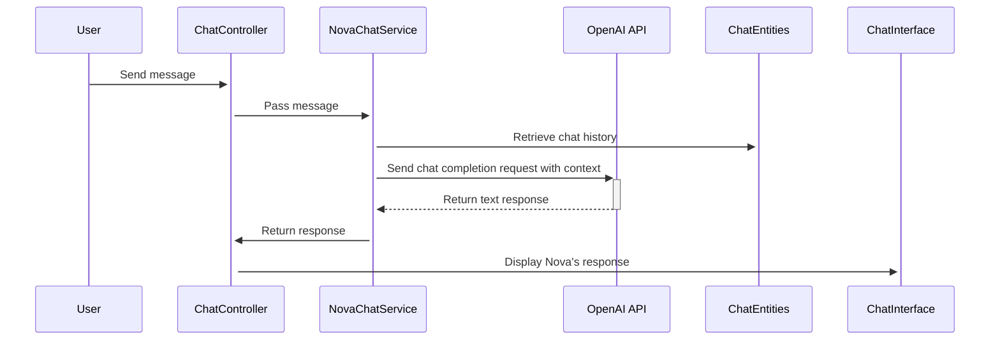

## Nova Chat Overview

**Audience**: New Developer Introduced to the Project

**Purpose**: Provide a high level overview of the chat feature and its components

The Nova Chat feature in NutriNova serves as an AI-powered assistant designed to provide users with real-time support and guidance related to their nutritional goals. It leverages the capabilities of OpenAI's GPT-3.5-turbo language model to deliver informative and contextually relevant responses to user inquiries.

### Components

1. **Chat Interface**: The chat interface offers a user-friendly space for users to interact with Nova. It typically appears as a chat window accessible from various sections within the application.
2. **NovaChatService**: This service acts as the intermediary between the user interface and the OpenAI API. It receives user messages, constructs the appropriate context for the AI, and transmits requests to OpenAI.
3. **OpenAI API**: OpenAI's GPT-3.5-turbo processes the requests and generates text responses based on the provided context and its understanding of language and nutrition.
4. **Chat Session Management**: NutriNova maintains chat sessions to preserve context and provide continuity in conversations with Nova. The `ChatSession` and `ChatMessage` entities in the `NutrinovaDbContext` store the chat history and associated metadata.

### Interaction with External Services

1. **OpenAI API**: The `NovaChatService` class utilizes the `Betalgo.OpenAI` library to communicate with the OpenAI API. It constructs chat completion requests containing the conversation history and system instructions, and then sends them to OpenAI for processing.
2. **USDA Database (Potential Future Integration)**: While not currently implemented, there are plans to integrate with the USDA database to enhance Nova's ability to provide information on specific foods and their nutritional content.

### Location in App

The chat interface is intended to be accessible from most pages within the NutriNova application, providing users with convenient access to Nova's assistance. The specific implementation and placement of the chat window may vary depending on the page and user interface design.

### Example Workflow

1. **User Initiates Chat**: The user opens the chat window and types a question or request.
2. **Message Processing**: The `ChatController` receives the user's message and passes it to the `NovaChatService`.
3. **Context Preparation**: The `NovaChatService` constructs the context for the AI, including the current conversation history and the system prompt that defines Nova's role and expertise.
4. **OpenAI Request**: The service sends a chat completion request to the OpenAI API.
5. **Response Generation**: OpenAI processes the request and generates a text response based on the provided context.
6. **Response Delivery**: The `NovaChatService` receives the response from OpenAI and sends it back to the `ChatController`.
7. **Displaying Response**: The chat interface displays Nova's response to the user.

